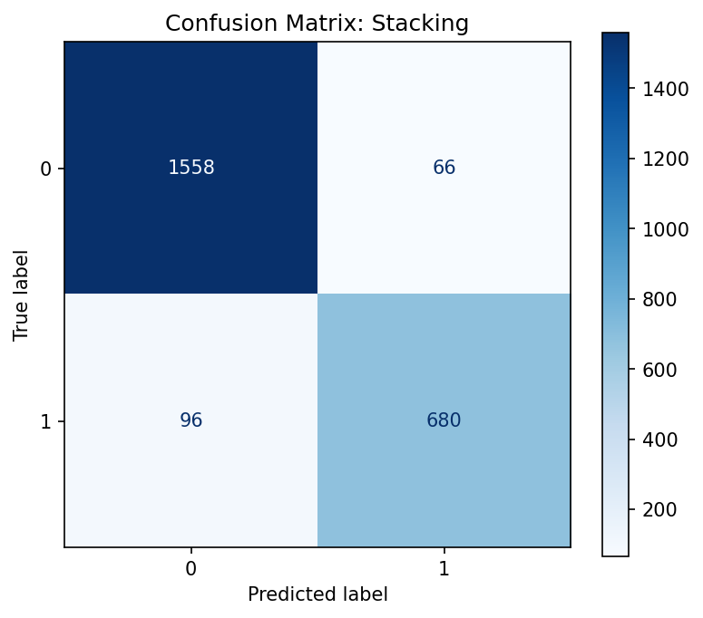

# HW06 – Report

> Файл: `homeworks/HW06/report.md`  
> Важно: не меняйте названия разделов (заголовков). Заполняйте текстом и/или вставляйте результаты.

## 1. Dataset

- Какой датасет выбран: `S06-hw-dataset-01.csv`
- Размер: 12 000 строк и 26 столбцов
- Целевая переменная: `target` бинарная классификация. Класс 0 около 68% (8119), класс 1 около 32% (3881)
- Признаки: все признаки числовые (num01–num24), категориальные признаки отсутствуют. Пропусков и явно некорректных значений не обнаружено.

## 2. Protocol

- Разбиение: train/test = 80% / 20%, random_state=42
- Подбор: GridSearchCV только на обучающей выборке, 5-fold CV, оптимизировалась метрика F1
- Метрики: Accuracy — для общей оценки качества; F1-score — ключевая метрика из-за дисбаланса классов; ROC-AUC — для оценки разделяющей способности моделей, независимо от выбранного порога.

## 3. Models

Опишите, какие модели сравнивали и какие гиперпараметры подбирали.

- DummyClassifier (most_frequent) — наивный baseline.

- LogisticRegression (со StandardScaler) — линейный baseline.

- DecisionTreeClassifier — подбор max_depth, min_samples_leaf, ccp_alpha для контроля сложности.

- RandomForestClassifier — подбор max_depth, min_samples_leaf, max_features.

- GradientBoostingClassifier — подбор n_estimators, learning_rate, max_depth.

- StackingClassifier (опционально): ансамбль из Decision Tree, Random Forest и Gradient Boosting с финальной Logistic Regression и CV=5.

## 4. Results

- DummyClassifier — F1 = 0.000, ROC-AUC = 0.50

- LogisticRegression — F1 = 0.708, ROC-AUC = 0.875

- DecisionTree — F1 = 0.792, ROC-AUC = 0.895

- RandomForest — F1 = 0.879, ROC-AUC = 0.967

- GradientBoosting — F1 = 0.887, ROC-AUC = 0.969

- Stacking — F1 = 0.894, ROC-AUC = 0.969

Победителем выбран StackingClassifier, так как он показал наилучший F1-score и максимальный ROC-AUC, обеспечивая наиболее сбалансированное качество классификации.

## 5. Analysis

- Устойчивость: при изменении random_state качество одиночных моделей (Decision Tree) заметно колеблется, тогда как ансамбли (RandomForest, GradientBoosting, Stacking) демонстрируют стабильные метрики.
- Ошибки: Vатрица ошибок показывает высокое качество классификации обоих классов. Из 1624 объектов класса 0 корректно классифицированы 1558, ошибки ложноположительного типа (FP) составляют 66. Для миноритарного класса 1 корректно распознаны 680 объектов из 776, при этом наблюдается 96 ложноотрицательных ошибок (FN). Модель демонстрирует хороший баланс между precision и recall: большинство ошибок связано с пропуском части объектов класса 1, что типично для задач с дисбалансом классов и подтверждает корректность использования F1-score и ROC-AUC в качестве основных метрик.

- Интерпретация: permutation importance выявила, что наибольшее влияние оказывают признаки num19, num18 и num07. Остальные признаки из топ-10 вносят умеренный вклад и повышают устойчивость модели. Распределение важности выглядит ожидаемым и подтверждает, что модель опирается на информативные признаки, а не на шум.

## 6. Conclusion

- Простые baseline-модели недостаточны при наличии дисбаланса классов.

- Деревья чувствительны к гиперпараметрам и random seed.

- Ансамбли существенно повышают качество и устойчивость.

- Stacking позволяет объединить сильные стороны разных моделей.

- Использование F1 и ROC-AUC критично для корректной оценки бинарных задач.

- Чёткий ML-протокол предотвращает переоценку качества модели.
